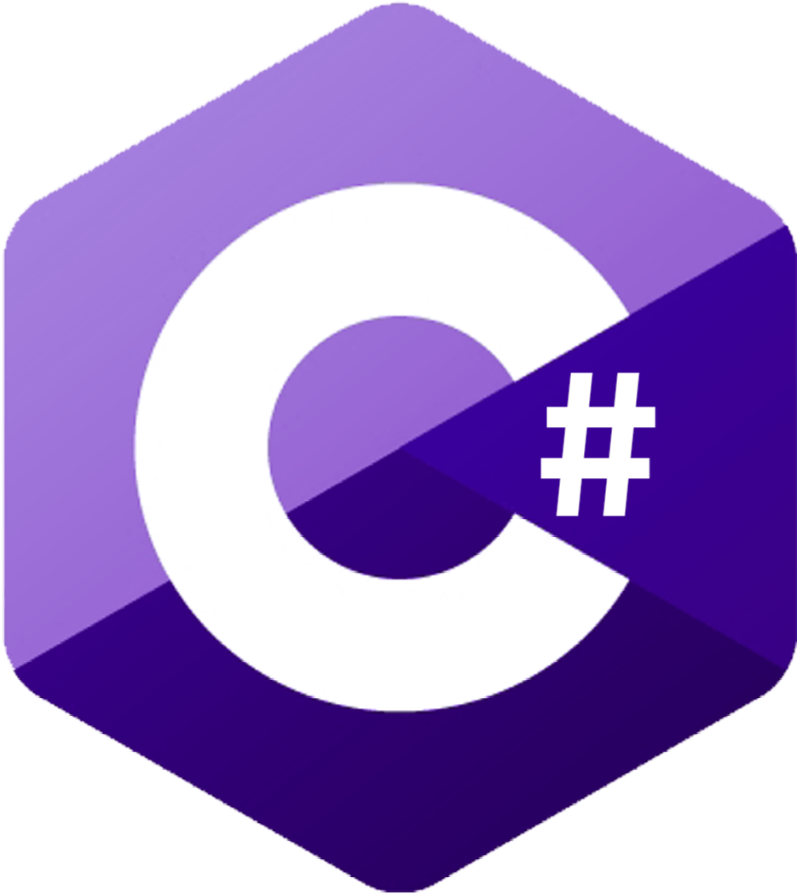

  <a href="000daniel.github.io">[home]</a>

# General C# Documentation
This site is built to provide documentation about topics in the C# programming language that I personally feel don't get enough coverage.

The purpose of these documentations is to make said niche topics easy to understand and easy to utilize in your programming projects.

Some of the documents focus on the Godot game engine.
The recent popularity and growth boost in the Godot game engine made me realise just how lacking some of the C# documentations are. And so it inspired me to make this site.

###### If you find errors in this site, please report them over to the relevant GitHub repository.
