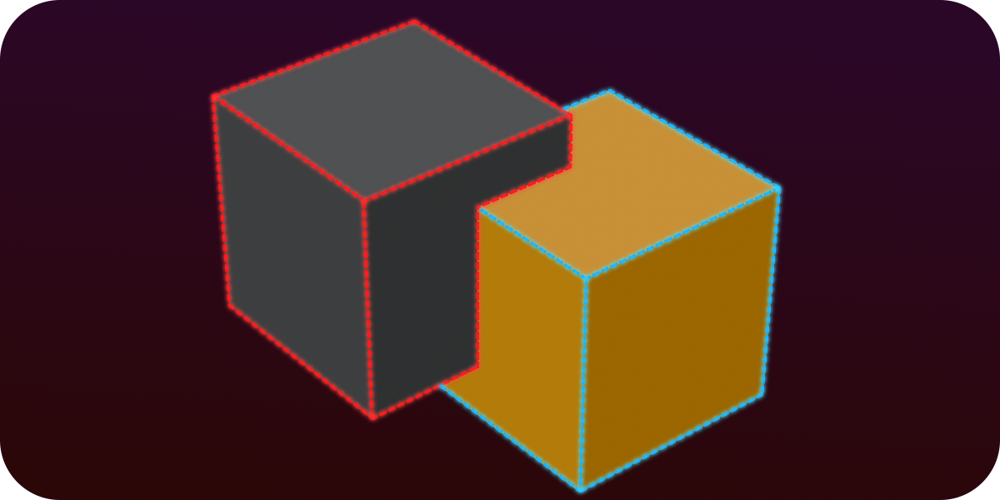

<h1 align="center">About</h1>

This site is built to provide documentation and guides about topics in the C# programming language. 
The purpose of these pages is to make said topics easy to understand and easy to utilize in your programming projects.  
Some of the documents here focus on the <a href="https://godotengine.org/">Godot game engine</a>. 

<h1 align="center"> Documents </h1>

  

<table style="border-collapse: collapse; border: none;">
        <tr style="border: none;"> 
            <td style="border: none;">
            

<a href="https://000daniel.github.io/Ray-Cast-Godot/">3D Ray Cast Godot Tutorial  </a>
  
            </td>
            <td style="border: none;">
              

<a href="https://000daniel.github.io/Collision-Mask-Layer/">Collision Masks and Layers Godot Tutorial</a>

            </td>
          <td style="border: none;">
              

<a href="https://000daniel.github.io/Draw3D-Godot/">Draw3D Godot Tutorial  </a>

            </td>
        </tr> 
</table>
